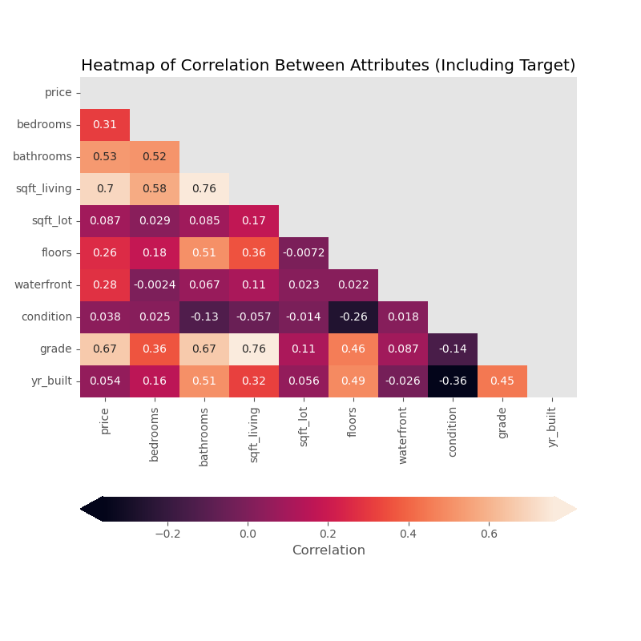
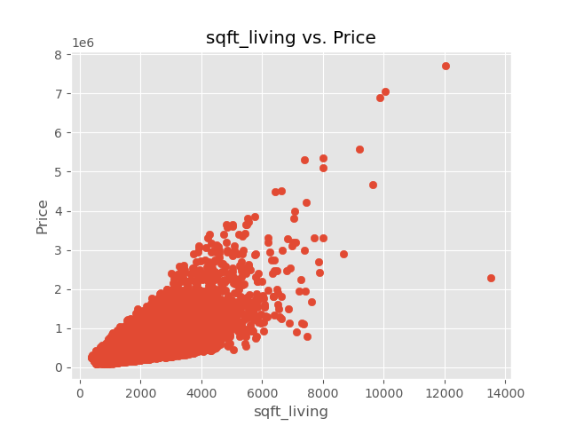

    <h1>Analysis of House Sales in a Northwestern County</h1>
        

## Project Overview
This project analyzes the various home characteristics that could affect the price of a house unit.I use regression analysis modeling on the King County data to get the best house price prediction features that can be used to predict the prices of the houses within Northwestern County and by what amount.

## Business Problem
Housing business for home owners is not doing quite well in Nothwestern county. A better marketing strategy that would lead to increased house sales needs to be developed.I use the data from King County Housing Authority to perform regression analysis so as to come up with the insights on the features that can affect or increase house sales.
Some of the questions I seek to answer are as below:
* Does the overall condition of the house affect its sale price?
* Does the overall grade of the house affect the sale price
* Is the age of the house an important factor to consider while selling the house?
* Does the size of the living room affect the pricing?
* Does the number of bedrooms or bathrooms affect the sale price of a house?
* Do houses with water fronts escalate the price of houses?
  
## Data Understanding
The data for this analysis has been sourced from an existing dataset in Kings County Housing Authority.It is located in the data/kc_house_data.csv, with columns descriptions in data/column_names.md.Every column in this dataset represents a home  that was sold through Kings County Housing Authority. The reqirements in this section involve loading the data using the relevant libraries, explore the data distributions, check the data types, explore correlations and feature engineering.
The features to focus on are as below as they are theones that determine the house prices in Kings County Housing Authority:
* **price:** - Sale price of the house in dollars(prediction target)
* **grade:** - Overall grade given to the housing unit, based on King County grading system
* **condition:** - How good the house condition is ( Overall )
* **yr_built** - The year the house was built
* **bedrooms** -The number of bedrooms the house has
* **bathrooms** - The number of bathrooms
* **sqft_living** - The House’s Yard Square-footage
* **sqft_lot** - footage of the lot
* **floors** - floors (levels) in house
* **waterfront** - House which has a view to a waterfront

## Data Preparation

The dataset has a total of  21,597 observations with 20 columns to analyze. But some of its variables may not be in accordance with the main features highlighed in the data understanding section. We will therefore drop columns such as views, qft_above, sqft_basement, yr_renovated, zipcode, lat, long, sqft_living15, sqft_lot15 because these variables do not have much effect on the house pricing in Kings County.

## Data Exploration
This section indicates the correlation between each variable and  the price  as shown below by the correlation as shown in the figure below.

## Modeling
### The Baseline Model is generated from the most corelated feature to the price

Below is a visualization to illustrate this using a scatter plot

The model performance is at approximately 49%, similar to the validation score that is about  49% too. This can only predict the house price up to 50%.We have to look for another approach to see whether our model performance improves

### The second model is built using all the numeric features

Below is a visualization of all the matplotlib's scatter plot

This second model got much better scores on both the training data and the validation data. The performances for the training and testing data are still quite low 64% and 65% respectively ie less than 70%. I will try a third model to see whether our perfomances improve further

### Investigate for multicollinearity using StatsModels to fit and evaluate a linear regression model on the features used in our second model

From the above summary,it is noted that the features don't exhibit multicollinearity.Also checking on the on the p-values we see that all our features are statistically significant since all of them have a p-value (P>|t|) of less than 0.05.I therefore don't drop any of the features.

### Selecting Features with sklearn.feature_selection

From the algorithm we see that all our features' coefficients are selected as important. We therefore go ahead to build and evaluate our final model.We will continue using our X_train_final data

### Build and Evaluate a Final Predictive Model

From our model we get an R-squared score of 64%. We then convert this to Root mean squared error for readability for our stakeholders
and we find out that RMSE is 216596.78. This means that for an average price of a house unit, this algorithm will be off by about $ 216596.78 

# Interpreting the Final Model

According to our model, the base price for a house in King County (the model intercept) is about $ 6672793.67
The price of a house unit however fluctuates with change in below factors. 

<table>
<tr>
<th>Predictor</th>
<th>Estimated Price Change in ($)</th>
<th> Explanation</th>
</tr>

<tr>
<td>bedrooms</td>
<td> -42176.745449</td>
<td> A unit increase in number of bedrooms decreases the house price by $ -42176.745449</td>
</tr>

<tr>
<td>bathrooms</td>
<td>50786.621402</td>
<td> A unit increase in number of bathrooms increases the house price by $ 50786.621402</td>
</tr>

<tr>
<td>sqft_living</td>       
<td>182.745921</td>
<td> A unit increase in sqft_living area increases the house price by $ 182.745921</td>
</tr>

<tr>
<td>sqft_lot</td>          
<td>-0.234938</td>
<td> A unit increase in sqft_lot area decreases the house price by $-0.234938</td>
</tr>

<tr>
<td>floors</td>          
<td>21108.619332</td>
<td> A unit increase in house floors increases the house price by $ 21108.619332</td>
</tr>

<tr>
<td>condition</td>
<td>17830.204723</td>
<td> A unit increase in house condition increases the house price by $ 17830.204723</td>
</tr>

<tr>
<td>grade</td>
<td>127477.487846</td>
<td>A unit increase in house grade increases the house price by $ 127477.487846</td>
</tr>

<tr>
<td>yr_built</td>
<td> -3829.603494</td>
<td>A unit increase in the year when the house was built decreases the house price by $ -3829.603494</td>
</tr>

<tr>
<td>waterfront</td>
<td> 787274.580114</td>
<td>A unit increase in house with a waterfront view increase the house price by $ 787274.580114</td>
</tr>
</table>

Before assuming that these coefficients give us inferential insight into past pricing decisions, we should investigate each of the assumptions of linear regression, in order to understand how much our model violates them.

### Investigating Linearity

check whether the linearity assumption holds by plotting the actual price values against the predicted price values

We have some outliers, but in general it looks like we have a linear relationship between the actual price and the predicted price (not violating this assumption)

### Investigating Normality

Check whether the normality assumption holds for our model by plotting a distribution curve of the residuals using QQ-plot

We can notice some outliers, but we can say that the data is relatively normal

### Investigating Multicollinearity (Independence Assumption)

We measure multicollinearity with variance inflation factor. A "rule of thumb" for VIF is that 5 is too high (i.e. strong multicollinearity).
All the features except sqft_lot, waterfront have their variance Inflation factor way above 5. We therefore a very high multicollinearity in our features.

### Investigating Homoscedasticity

check whether the model's minimized errors are indeed homoscedastic or if they violate this principle and display heteroscedasticity by plotting predictions against the residuals

The plot forms a close to perfect funnel shape, around the residual and prediction values, hence obeying the homoscedacity assumption

### Linear Regression Assumptions Conclusion

We can be confident in our model coefficients since the only assumption being violeted is multicollinearity, which sometimes in actual sense each feature could be having an effect on the house price in King County. We can use this model for both inferential and predictive purposes.

### Conclusion

The variables that will affect the price change of each house unit in Northwestern county are the number of bedrooms, number of bathrooms, sqft_living, floors, waterfront, condition, grade, yr_built  with an RMSE(Root Mean Squared Error) value of $ 216596.78. From final model interpretation,we see that 
Older houses and number of bedrooms have a negative change in price. While number of bathrooms, sqft_living, floors, waterfront, condition, grade have a positive impact on the price. 

### Recommendations

1. Older houses can be renovated to include feaatures such as waterfront because each house unit that has a waterfront equals to the a price increace of  $ 787274.58.

2. Home owners should build more houses that have more than one floor since the value price increment  for each house is quite high -approximately $ 127477.49

3. The unit area change  of the living room also affects the price by 182.74. Home owners should build houses that have larder living areas inorder to increase the house price.

4. The overall condition change of the house constitutes $ 17830.20 price increase. Home owners should look for means to improve the overall condition of the house by perhaps reparing bathrooms or even increasing the number of the bathrooms in the house

5. Home owners should also seek to change the real estate grading of their houses if possible since an upward change in the grade of the house increases the house price by $ 127477.48

## For More Information
See full analysis in <a href ="student.ipynb">student.ipynb</a> or my presentation <a href ="presentation.pdf">here</a>

# Repository Structure

├── data 
├── images 
├── README.md 
├── Presentation.pdf 
└── student.ipynb